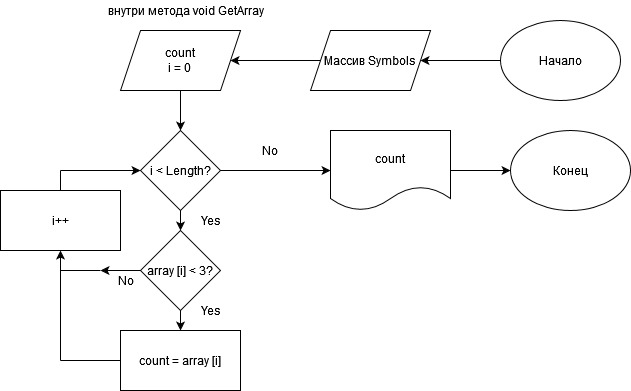

##
*Описание решения*
1. Создаем массив "Symbol" типа string, так как "оперрируем" символами в коде.
2. Создаем метод "GetArray". Внутри метода прописываем цикл "for" c условием: начинаем от 0 и до конца длины массива с шагом 1.
3. Внутри цикла прописываем дополнительное условие "if" - каждый элемент массива сравнить со значением 3. Если количество элементов меньше или равно 3, то записывать данный индекс (элемент) в счетчик "count", объявленный ранее.
4. Выводим на консоль все элементы содержащиеся в "count".
5. Объявляем метод "GetArray" и передаем в него массив "Symbol.
